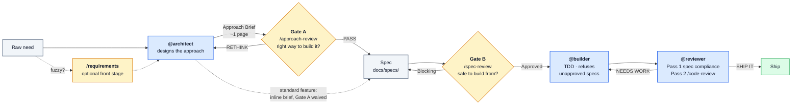

<div align="center">

# aa-agentic-workflow

**A governance layer for AI-assisted software development.**

Agents don't write code until a spec exists, an independent reviewer has audited it, and you've said go.

[](CHANGELOG.md)
[](LICENSE)
[](https://docs.claude.com/en/docs/claude-code)
[](https://github.com/obra/superpowers)

[Getting started](docs/GETTING-STARTED.md) · [Workflow guide](docs/WORKFLOW.md) · [Design rationale](docs/DESIGN.md)

</div>

---

## The problem

Handing a feature to a coding agent works right up until the feature is non-trivial. Then three things go wrong, every time:

- **The agent designs while it codes.** The first plausible approach becomes the implementation. Alternatives are never considered, and the trade-off is invisible in the diff.
- **Nobody audits the plan — only the result.** By the time a bad decision shows up in code review, it costs a rewrite. The cheap moment to catch it has passed.
- **"Done" is self-reported.** The same context that wrote the code decides whether the code is correct. There is no independent check that what was built is what was asked for.

The usual answer is a better prompt. That doesn't scale — the failure isn't phrasing, it's the absence of structure.

## The approach

This plugin adds an **SDLC pipeline with enforced approval gates** to Claude Code. Design is a separate stage from implementation, performed by a separate agent, and challenged by independent reviewers who never see the designer's reasoning. Nothing gets built from an unapproved spec — and that's enforced by the harness, not by asking the model nicely.



Every stage produces a named artifact with a `Status:` field, and **status is law** — the Builder refuses to touch implementation code unless the spec on disk reads `Approved`.

The pipeline also has a **unit contract**: the build loop consumes only one shape of work — one spec, one cohesive capability (~5–12 acceptance criteria, ≤3 components), reviewable in one cycle. Work can be handed in at **any maturity** — a fuzzy paragraph, a ticket, a half-decided design — and the upstream stages convert it into approved units before anything is built.

## What it owns, what it rents

The design principle is **own decisions, rent techniques**. This plugin owns the governance layer and nothing else — every generic capability is delegated to its upstream owner, so there's no duplicated prose to maintain.

| Owned here | Rented |
|---|---|
| Artifacts: Requirements doc, Approach Brief, Task Map, Spec | TDD discipline → `superpowers:test-driven-development` |
| Gates A & B, and their verdict semantics | Debugging → `superpowers:systematic-debugging` |
| Role agents: Architect · Builder · Reviewer | Done-claim verification → `superpowers:verification-before-completion` |
| Status lifecycle + structural enforcement (hooks) | Ideation → `superpowers:brainstorming` |
| `R#` requirement → task → spec → test traceability | Generic quality review → built-in `/code-review` |
| Spec-compliance review (Reviewer Pass 1) | Security scan → built-in `/security-review` |

## The two gates

Both are review checkpoints run by **fresh-context reviewers** — they never inherit the Architect's reasoning, so they can't be argued into agreement. They differ in what they review and what failure costs.

|  | **Gate A** — `/approach-review` | **Gate B** — `/spec-review` |
|---|---|---|
| Reviews | the Approach Brief (~1 page) | the full spec, before any code |
| Asks | *Is this the right way to build it?* | *Is this complete and safe to build from?* |
| Method | 3–5 hard questions as an experienced CTO | up to 5 independent audits: Security · Scalability · API Design · Completeness · Scope |
| Verdict | PASS → `Approach-Approved` · RETHINK → `Draft` | Approved → Builder unlocked · Blocking → `Draft` |
| Failure costs | one revised page | one revised spec — still no code written |

**Cheap before expensive:** the strategic challenge happens while rework is a page; detail auditing only runs on an approach that already survived.

### Which gates run, by risk of work

The Architect diagnoses where the work enters and how much rigor it deserves; you confirm or override.

| Path | What it is | Gate A | Gate B |
|---|---|---|---|
| **Chore** | typo, config tweak, no behavior change | — direct chat, no pipeline | — |
| **Task** | bounded, ≲3 files, clear criteria | — straight to `@builder` | — no spec exists |
| **Feature** | new behavior, single service | **waived** — inline brief in chat, waiver recorded | **lite** — 1 auditor, focused perspectives |
| **Open-design feature** | 2+ viable approaches, new dependency, contract change | **runs** | lite |
| **System change** | cross-service, migration, new infra, irreversible | **mandatory — not waivable** | **panel** — 5 parallel auditors |

Note the asymmetry: **Gate A is the waivable one, Gate B isn't.** The fast path compresses ceremony, never the last check before code. And it self-corrects — if a genuine design question surfaces while the spec is being written, the Architect stops and promotes the work to a full brief plus Gate A rather than designing through it.

## Install

```bash
claude plugin marketplace add AmirAnckonina/aa-agentic-workflow
claude plugin install aa-agentic-workflow@aa
```

The repo is its own marketplace. [Superpowers](https://github.com/obra/superpowers) is a declared dependency and installs automatically. Agents and commands load on the **next** session.

Full setup, verification, and a first end-to-end run: **[docs/GETTING-STARTED.md](docs/GETTING-STARTED.md)**.

## A feature, end to end

```text
> @architect Add rate limiting to the POST /logs endpoint.

  Context loaded: docs/agentic-context.md, CLAUDE.md, internal/api/logs.go
  Standard feature — single service, one viable approach → inline brief, lite spec review.

  Inline brief — token bucket per API key, in-process, 100 req/min.
    Rejected: Redis-backed counter — adds an infra dependency for
    single-instance traffic volumes.
    Key risk: limits reset on deploy. Acceptable at current scale.

  Approve the approach?

> go

  Wrote docs/specs/logs-rate-limit.md [Draft] — 7 acceptance criteria.
  Run Gate B?

> /spec-review docs/specs/logs-rate-limit.md

  Gate B mode: lite (feature) — 3 focused perspectives: Completeness, Scope, Security
  BLOCKING (Security): AC-4 leaks the remaining quota to unauthenticated
    callers via the 429 body. Return Retry-After only.
  Verdict: Blocking → spec returned to Draft
```

Gate B caught it **before a line of code existed**. The spec gets one revision, re-runs the gate, and only then does `@builder` start — and it verifies structurally that the status reads `Approved`.

## What ships

```
agents/     architect (opus) · builder (sonnet) · reviewer (sonnet)
skills/     spec-format · architect-methodology · decomposition · requirements-composition
            approach-review (Gate A) · spec-review (Gate B) · coding-standards
commands/   /requirements · /review-internal
docs/       GETTING-STARTED · WORKFLOW · DESIGN
```

Two structural guarantees are enforced by `PreToolUse` hooks rather than prompt text: the Builder cannot edit implementation files when the matched spec isn't `Approved` (**spec-gate**), and the Builder cannot commit, push, merge, or rebase (**git-guard**) — commits stay a human action so the Reviewer always has a real diff to review. Both fail open if `jq` is missing.

## Where to go next

| If you want to… | Read |
|---|---|
| Install it and run your first feature | [docs/GETTING-STARTED.md](docs/GETTING-STARTED.md) |
| Drive the pipeline day to day — routing, gates, multi-spec features | [docs/WORKFLOW.md](docs/WORKFLOW.md) |
| Understand why it's built this way | [docs/DESIGN.md](docs/DESIGN.md) |
| See what changed between versions | [CHANGELOG.md](CHANGELOG.md) |

## Requirements

- **Claude Code** — current version (agent `skills:` preloading, `PreToolUse` hooks, nested subagents)
- **[Superpowers](https://github.com/obra/superpowers)** — required, installed automatically as a declared dependency
- **`jq`** — powers the Architect write-guard and the Builder gate hooks (all fail open if absent)

> **Namespacing:** plugin components are namespaced in real use — `/aa-agentic-workflow:spec-review`, `@aa-agentic-workflow:architect`. The docs use short names for readability.

## License

[MIT](LICENSE) © Amir Anckonina
