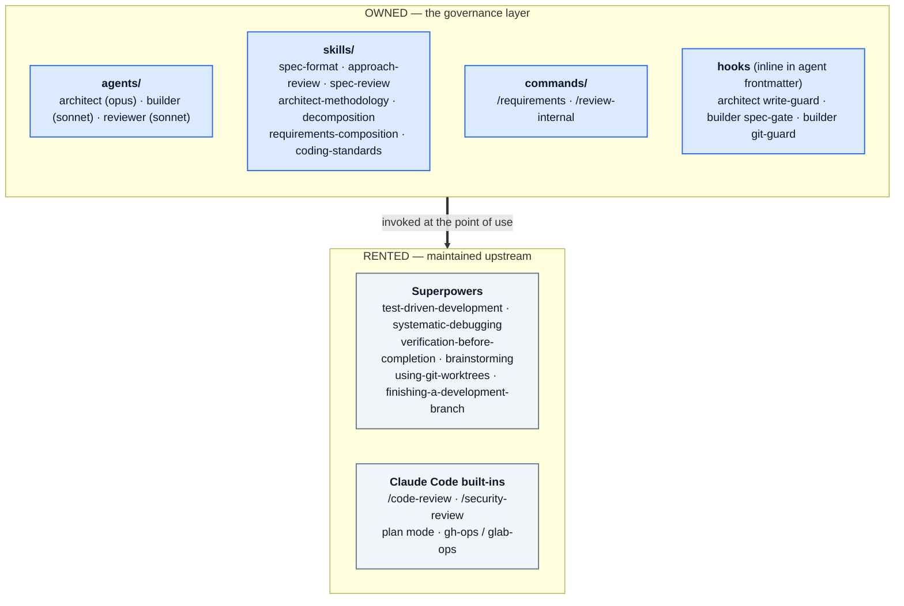

# Design Rationale

> **You are here:** why the pipeline is built this way. · [README](../README.md) · [Getting started](GETTING-STARTED.md) · [Workflow guide](WORKFLOW.md)

**Owner:** Amir Anckonina · **Current version:** 0.7.0 · Version-by-version history is in the [CHANGELOG](../CHANGELOG.md).

---

## 1. TL;DR

One SDLC workflow covering intake → discovery → approach → spec → build → review → ship, where **only the governance layer is owned here** — artifacts, gates, status lifecycle, role wiring — and everything else is **delegated**: techniques to Superpowers, tactical verbs to Claude Code built-ins. A routing layer sizes the process to the task so small work never pays pipeline tax. A per-repo context contract makes every stage's inputs explicit and user-controlled. It ships as a versioned Claude Code plugin.

The thesis in one line: **the failure mode of agentic coding isn't capability, it's the absence of structure** — so add structure, and only structure.

## 2. Goals and non-goals

**Goals**

| | |
|---|---|
| **G1** | Effective SDLC governance — spec as source of truth, enforced gates, clear role boundaries |
| **G2** | Minimal maintenance surface — never reimplement what Superpowers or built-ins already maintain |
| **G3** | Proportional process — trivial fixes stay frictionless; big features get full rigor |
| **G4** | Explicit, user-controlled context — every stage states what it read; nothing implicit |
| **G5** | The user controls the flow — gates present verdicts; the pipeline never auto-advances past one |
| **G6** | Distributable — installable and updatable as a versioned plugin, not a pile of symlinks |

**Non-goals**

- **Multi-user / team features.** Single-user first. Plugin packaging keeps the door open; nothing in the design assumes one operator forever.
- **CI/CD integration** beyond what `gh-ops` / `glab-ops` already do on request.
- **An orchestrator.** Deliberate — see §6.7.

## 3. Design principles

1. **Own decisions, rent techniques.** Custom artifacts encode *our* rules — gates, lifecycle, roles. Generic know-how (TDD, debugging, brainstorming, quality review) is invoked from its upstream owner, never copied.
2. **Artifact + gate per stage.** Every stage produces a named artifact with a `Status:` field. The status is the single source of truth, and downstream stages check it **structurally, not by convention**.
3. **Cheap before expensive.** Challenge the approach on a one-pager before anyone writes a full spec; audit details only after the approach survives.
4. **Explicit context.** Subagents don't inherit `CLAUDE.md`. Every stage's Step 0 loads the declared context and reports it. This is a feature, not a workaround — it's the control point.
5. **Declared dependencies, no fallbacks.** Superpowers is a prerequisite. There is no duplicate prose carried "in case it's missing" — that duplication was the previous generation's largest maintenance debt.

## 4. Plugin architecture



### Ownership matrix

| Concern | Owner | Mechanism |
|---|---|---|
| Spec format & lifecycle | **ours** | `spec-format` skill — the artifact contract |
| Approach challenge (Gate A) | **ours** | `approach-review` skill |
| Detail audits (Gate B) | **ours** | `spec-review` skill + 5 perspective checklists |
| Role agents & wiring | **ours** | `agents/architect.md`, `builder.md`, `reviewer.md` |
| Approved-gate enforcement | **ours** | Builder Step-0 refusal + `PreToolUse` spec-gate hook |
| Spec-compliance review | **ours** | Reviewer Pass 1 |
| Architecture reasoning lenses | **ours** (curated) | `architect-methodology` skill |
| Decomposition method | **ours** | `decomposition` skill (on-demand) |
| Ideation / intent discovery | Superpowers | `brainstorming` |
| TDD discipline | Superpowers | `test-driven-development` |
| Debugging discipline | Superpowers | `systematic-debugging` |
| Done-claim verification | Superpowers | `verification-before-completion` |
| Branch finishing / worktrees | Superpowers | `finishing-a-development-branch`, `using-git-worktrees` |
| Generic quality review | built-in | `/code-review` |
| Security scan | built-in | `/security-review` (Reviewer Pass 2, when the diff warrants) |
| Git-host operations | ours (thin) | `gh-ops` / `glab-ops`, remote-verified, on request |

The right column is the point. Roughly half the pipeline's capability is code this repo does not own, does not version, and does not have to keep current.

## 5. Artifact lifecycle

```
Approach Brief:  Draft → Approach Review → Approach-Approved | RETHINK → Draft
Full Spec:       Draft → Detail Audit    → Approved          | Blocking → Draft
```

Briefs live in the target repo's `docs/briefs/`, specs in `docs/specs/`, Task Maps in `docs/plan/`, requirements in `docs/requirements/` — subdirectories rather than a flat `docs/`, so multi-feature repos stay navigable.

The spec's front matter links its brief. Gate B verifies that brief is `Approach-Approved` — or that Gate A was explicitly waived and recorded, which T3 does not permit. The Builder starts only on `Status: Approved`; T1 inline tasks are exempt because no spec exists for them.

## 6. Key decisions

### 6.1 Two gates, not one

A single review gate has to choose an altitude. Placed early it can't audit details that don't exist yet; placed late it discovers strategic problems after a full spec is written. Splitting it lets each gate ask exactly one question at the moment that question is cheapest to answer:

- **Gate A** asks *is this the right way?* — failure costs one revised page.
- **Gate B** asks *is this safe to build from?* — failure costs one revised spec, still with no code written.

The economics are the whole argument. Everything downstream of a decision inherits its cost, so the challenge belongs upstream.

### 6.2 Fresh context for reviewers

Gate auditors and the Reviewer never inherit the producing agent's conversation. An agent that saw the reasoning tends to validate it — reviewing your own work is not review, and this holds for models at least as strongly as for people. Auditors read the artifact and the codebase, nothing else.

The corollary: Gate B auditors *do* read Gate A's outcome, specifically so they don't re-litigate settled strategic concerns as fresh suggestions. Independence is about not inheriting reasoning, not about withholding conclusions.

### 6.3 Structural enforcement over prompt adherence

The two load-bearing Builder invariants are `PreToolUse` hooks, not instructions:

- **spec-gate** — blocks `Write`/`Edit` on implementation files when the branch's matched spec isn't `Approved`. `docs/` edits always pass; `AA_GATE_OFF=1` bypasses deliberately.
- **git-guard** — blocks `git commit`/`push`/`merge`/`rebase`/`reset`/`checkout -b`. Read-only git still works, and the guard is Builder-scoped, so a human's own commits are unaffected.

A rule that matters should not depend on the model choosing to follow it. Both hooks **fail open** at every external step — a missing `jq` or a non-git directory degrades to the unenforced path rather than bricking the pipeline.

The git-guard has a second purpose beyond enforcement: because the Builder cannot commit, committing is always a human action, which guarantees the Reviewer has a real branch diff instead of an ambiguous working tree.

### 6.4 Proportional process

Uniform rigor is the reason heavyweight processes get abandoned — pay T3 costs on a typo often enough and the whole thing gets bypassed. So the pipeline scales cost to risk along three independent axes: **tier** (T0–T3), **Gate B breadth** (skip / lite / panel), and **model tier** (Sonnet for mechanical stages, Opus for design-critical ones).

Two guardrails keep the cheap path honest. **Promotion:** any stage that surfaces a genuine design question stops and escalates rather than improvising — a T1 Builder recommends T2, a fast-track Architect promotes to a full brief plus Gate A. **Escalation:** a lite Gate B auditor that finds real risk recommends re-running the panel. The system is allowed to be cheap precisely because it is designed to notice when it shouldn't be.

Note what is deliberately *not* scaled down: Gate B keeps full Opus depth at both tiers. Lite is cheaper by **breadth** — a focused perspective set and one auditor instead of five — never by reasoning quality. It's the last check before code exists.

### 6.5 Explicit context contract

Subagents not inheriting `CLAUDE.md` is a platform constraint. Rather than working around it, the design leans into it: each target repo may declare `docs/agentic-context.md`, every stage reads it at Step 0, and every stage's output opens with `Context loaded: <list>`.

This converts an invisible failure ("the agent didn't know about our conventions") into a visible, checkable line of output. Skills invoked *from* a stage inherit that stage's conversation, so they operate on the same loaded context with no extra wiring.

### 6.6 Spec-then-tasks, decomposition inside the Architect

**Research grounding.** Three passes over Spec Kit, Kiro, OpenSpec, Taskmaster, BMAD, and Anthropic's own guidance found unanimous convergence on **spec-then-tasks**: a *feature-level* design comes first, and tasks are derived from it afterward by a **cheap step run by the same agent**. A separate role and gate for decomposition only earns its keep at team scale. One spec maps to many tasks; a task is roughly one independently testable unit.

The inverse — a gated decomposition front stage producing one spec per task — was built as a draft and **rejected**: it is the one model none of the surveyed tools use, and it invites the "waterfall in markdown" failure mode.

For solo and fast work the consensus is **keep the artifact, drop the gate**, so decomposition is ungated for T1/T2 with an optional T3 coverage audit. The approach was already challenged at Gate A; the split is a derivative of an approved design.

### 6.7 No orchestrator

The Task Map is a **ledger, not a runner**. A human picks the next task whose dependencies are complete; the Architect writes that spec just in time; the existing per-task flow does the rest.

This is a real decision, not a missing feature. An auto-runner would have to make scheduling judgments across a partially-built system with no gate of its own — precisely the class of decision the rest of the design routes to a human. Specs are durable; context is disposable. Writing specs just in time keeps the design honest against a codebase that has moved since the brief.

### 6.8 The Reviewer split

- **Pass 1 — spec compliance (ours, the moat).** A mechanical check of code against the Approved spec: every acceptance criterion covered by a test, interfaces matching, no unspecified behavior added, no spec section silently unimplemented. Output is a per-AC table.
- **Pass 2 — quality (delegated).** Invoke `/code-review` at an effort level set by tier (T2 medium, T3 high), plus `/security-review` when the diff touches auth, input handling, or secrets. If the repo's context manifest declares a review-rules file — past incidents, tribal knowledge — those rules are injected into the Pass 2 prompt.
- **Verdict (ours).** SHIP IT / NEEDS WORK / BLOCKER, synthesized from both passes. The terminal report is the deliverable; git actions happen only on explicit request.

Pass 1 is the part no general-purpose reviewer can do, because it requires an approved spec to compare against. That's why the pipeline produces one. Pass 2 is a solved problem, so it is rented — an earlier six-lens review system was deleted outright when `/code-review` made it redundant.

### 6.9 Traceability spine

`R#` (requirements doc) → Task Map `Requirements` column → spec `**Requirements:**` line → Builder AC → Test map → Reviewer Pass 1 check. A requirement can be followed to the test that proves it. The Pass 1 traceability check is marked IMPORTANT but never blocking — traceability is a navigation aid, and making it a hard gate would punish legitimately untraceable work like exploratory fixes.

## 7. Packaging

```
aa-agentic-workflow/
├── .claude-plugin/
│   ├── plugin.json          # manifest — version, dependencies (superpowers)
│   └── marketplace.json     # the repo is its own marketplace ("aa")
├── agents/                  # architect · builder · reviewer (hooks inline in frontmatter)
├── skills/                  # 7 skills; spec-review and requirements-composition carry references/
├── commands/                # /requirements · /review-internal
├── docs/                    # GETTING-STARTED · WORKFLOW · DESIGN
├── CHANGELOG.md
└── README.md
```

**Distribution.** The repo is its own marketplace (`marketplace.json`, name `aa`, source `"."`), so it installs in two commands. `superpowers` is declared in the manifest's `dependencies` and resolves from the official marketplace, so installation pulls it automatically; the Step-0 skill check in each agent remains as a safety net.

**Dev loop.** `claude --plugin-dir <repo>` loads it live with no install — edits take effect immediately (`/reload-plugins` for skills, restart for agents and commands). Installing from a local marketplace path is the alternative, refreshed by a version bump plus `claude plugin update`. The two are mutually exclusive.

**Versioning.** The version is pinned in `plugin.json`, so updates ship on deliberate bumps rather than on every commit.

## 8. Future slots

- **Brainstorm-as-artifact.** Partly addressed: `/requirements` rents `superpowers:brainstorming` and can structure an existing brainstorming doc into a Requirements doc. A standalone persisted intent-summary artifact remains unreserved.
- **Team-scale decomposition gate.** The research says a separate decomposition role and gate earns its keep at team scale. The `decomposition` skill is already a distinct on-demand module, so promoting it to a gated stage is an additive change, not a rewrite.

---

**How to drive it:** [WORKFLOW.md](WORKFLOW.md) · **How to install it:** [GETTING-STARTED.md](GETTING-STARTED.md)
