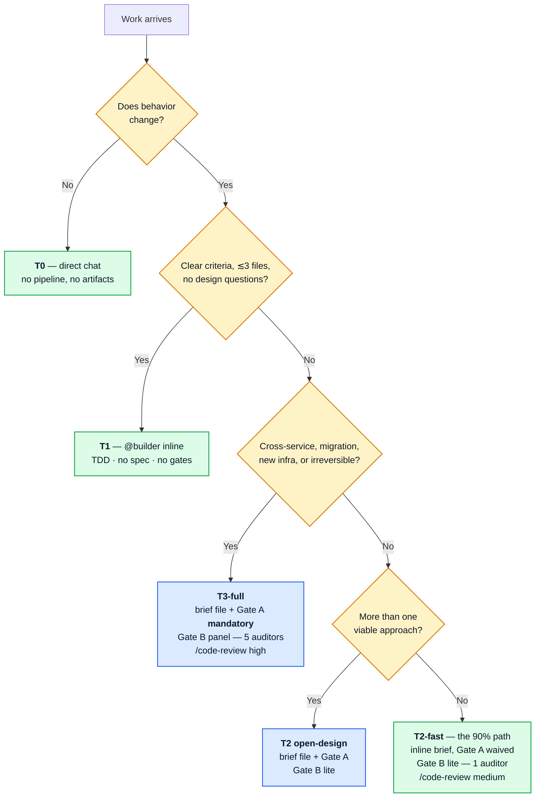
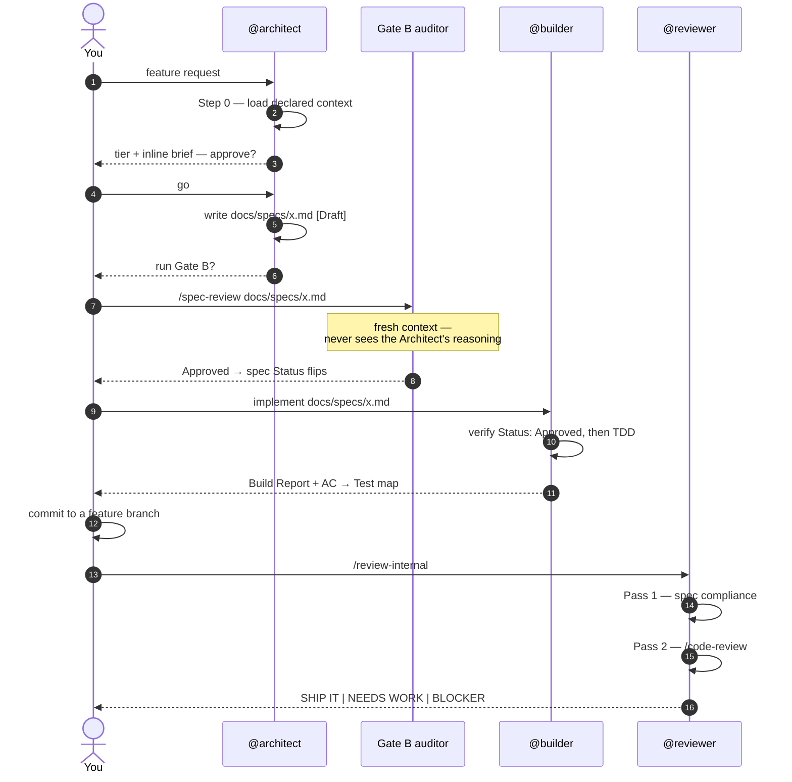
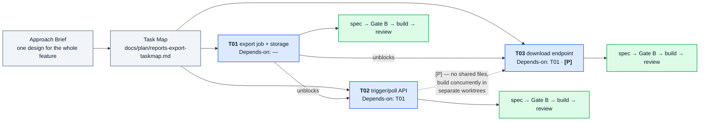

# Workflow Guide

> **You are here:** the operating manual — how to drive the pipeline day to day. · [README](../README.md) · [Getting started](GETTING-STARTED.md) · [Design rationale](DESIGN.md)

The pipeline: *(requirements →)* intake → discovery → approach → **decompose** → spec → build → review → ship. It is **spec-driven** — the design comes first, and a feature is split into task-specs only *after* the design, and only when it's more than one spec.

---

## The one principle

**Own decisions, rent techniques.** This workflow owns *governance* — artifacts, gates, the status lifecycle, role boundaries. Everything generic is delegated: TDD, debugging, and verification discipline to [Superpowers](https://github.com/obra/superpowers); generic quality review to the built-in `/code-review`.

The practical consequence: there is no duplicated prose here explaining how to write a test. If you want to know how the Builder does TDD, read Superpowers. This repo tells you *when* it's allowed to start.

## Routing — the pipeline proposes, you confirm

You don't classify work up front. Hand it over; the **Architect proposes** a tier in its first step and you confirm or override.



**Two defaults carry almost everything:**

| Default | When | Process |
|---|---|---|
| **T2-fast** — the 90% path | new behavior, design choices exist, single service | inline chat brief (Gate A waived + recorded) · Gate B **lite** (1 auditor) · `/code-review` medium |
| **T3-full** | cross-service, migrations, new infra, irreversible | brief artifact + Gate A **mandatory** · Gate B **panel** (5 auditors) · `/code-review` high |

Everything else is an **escalation the pipeline surfaces — never a knob you pre-select**:

- **Below T2, the agent tells you.** Hand a T0 or T1 to the Architect and it declines, naming the direct path instead.
- **Mid-flight promotion.** A T1 that surfaces a design question → the Builder stops and recommends T2. An ordinary T2 that surfaces one mid-spec → the Architect promotes to a full brief plus Gate A. **Nothing designs ad hoc.**
- **Gate-B breadth.** Lite by default; the auditor **auto-escalates to panel** on real risk (auth, migration, external API, irreversible). Force it with *"panel mode"*; waive it with *"skip Gate B"* (trivial changes only).

**Don't over-tier and don't over-split.** Running T3 rigor on T2 work, or decomposing what one spec could hold, is the biggest self-inflicted cost in the system.

## The pipeline, stage by stage

```
1. DISCOVERY        superpowers:brainstorming (chat — no artifact)
2. APPROACH BRIEF   ordinary T2: inline in chat (your nod = approval, waiver recorded)
                    T3 / open-design T2: @architect → docs/briefs/<topic>.md   [Draft]
      ⛩ Gate A: /approach-review — challenge the HOW on one page (artifact briefs only)
                    PASS → Approach-Approved · RETHINK → revise brief
2.5 DECOMPOSE       @architect: one spec or many? multi-spec → docs/plan/<topic>-taskmap.md
                    (ungated T1/T2 · T3 coverage audit optional · specs written just-in-time)
3. FULL SPEC        @architect → docs/specs/<topic>.md           [Draft, links brief + R# reqs]
      ⛩ Gate B: /spec-review — detail audits: lite = 1 auditor (T2) · panel = 5 (T3)
                    N/A sections skip their perspective · Approved · Blocking → revise spec
4. BUILD            @builder — starts ONLY on Status: Approved
                    TDD / debugging / verification via Superpowers skills
5. REVIEW           first: commit the Builder's work to a feature branch — you, or ask
                    (the Builder never commits; the Reviewer diffs the branch)
                    then: @reviewer (or /review-internal)
                    Pass 1: spec compliance (per-AC table) — ours
                    Pass 2: /code-review (effort by tier) + /security-review when warranted
                    → SHIP IT | NEEDS WORK | BLOCKER — terminal report is the deliverable
6. SHIP (on request) superpowers:finishing-a-development-branch + gh-ops/glab-ops
```

### Who does what, in order

The T2-fast path as an actual conversation:



Two properties of that diagram matter more than the sequence itself. The Gate B auditor runs in **fresh context** — it cannot be argued into agreement by reasoning it never saw. And the commit is **yours**, always: the Builder is structurally blocked from git write operations, which guarantees the Reviewer has a real diff.

## Gate mechanics

### Status is law

Every artifact carries a `Status:` field, and that field — not the conversation, not anyone's recollection — is the single source of truth. Downstream stages check it **structurally**.

```mermaid
stateDiagram-v2
    direction LR
    [*] --> BriefDraft: @architect writes brief
    BriefDraft: Brief — Draft
    BriefDraft --> ApproachReview: /approach-review
    ApproachReview: Brief — Approach Review
    ApproachReview --> BriefDraft: RETHINK
    ApproachReview --> BriefApproved: PASS
    BriefApproved: Brief — Approach-Approved

    BriefApproved --> SpecDraft
    [*] --> SpecDraft: fast track — Gate A waived, recorded
    SpecDraft: Spec — Draft
    SpecDraft --> DetailAudit: /spec-review
    DetailAudit: Spec — Detail Audit
    DetailAudit --> SpecDraft: Blocking findings
    DetailAudit --> SpecApproved: clean
    SpecApproved: Spec — Approved

    SpecApproved --> Building: @builder unlocked
    Building --> [*]
```



A non-pass verdict always returns the artifact to `Draft`, and the cycle re-enters at that same gate with **prior rounds preserved** — review history is appended, never overwritten.

### Gate consent

Every gate ends with a verdict presented to you. Nothing assumes your consent. "Go" is your word, given **per-gate** or **once for a segment** (*"run it through Gate B"*, *"…through the build"*): PASS verdicts then flow onward, but any RETHINK or Blocking stops the segment cold.

Segment consent never bypasses a gate — it only pre-answers "go" on a pass. And it never substitutes for `Status: Approved` at the Builder boundary, which is enforced by a hook rather than by agreement.

### Gate B: when to run which mode

| The spec is… | Gate B |
|---|---|
| Trivial or mechanical — no new logic, no external input, no contract change | **Skip** — marked Approved directly, recorded as `⏭️ Skipped`. Rare; such work is usually T0/T1 anyway. |
| Ordinary T2 (the default) | **Lite** — one **Opus** auditor, **focused** to the 2–3 perspectives that matter (Completeness + Scope always; Security / Scalability / API Design only if the surface triggers them) |
| T3, or a T2 touching **auth, migration, external API, or an irreversible change** | **Panel** — 5 independent Opus auditors in parallel. A lite auditor auto-escalates here if it smells real risk. |

Lite is cheaper by **breadth, not depth**. It keeps full Opus reasoning because Gate B is the last check before code exists — the model tier never drops here.

### Model tiering

Mechanical stages run on **Sonnet** (Reviewer — Pass 1 is objective and Pass 2 delegates; `/requirements` — EARS is a constrained format). Design-critical stages stay **Opus**: the Architect, Gate A, and Gate B at both tiers. Toggle `/fast` for design-heavy sessions — faster Opus output, same model.

## Front stage and decomposition

### Optional requirements front stage

Starting from fuzzy needs? Run `/requirements` first for a gated EARS requirements doc (`docs/requirements/<f>.md`, `R#` IDs). Already know the work? Skip it and go to `@architect`. The fast single-task path pays nothing for this stage existing.

### Decomposition lives inside the Architect

You do **not** split work up front. Hand a feature to `@architect`; it designs the brief, then decides **one spec or many**. Most features are one spec.

**The decision rule — "can one spec hold it?"** A spec is one cohesive capability: roughly 5–12 acceptance criteria, ≤5 interfaces, ≤3 components, readable in under five minutes. Fits → one spec. Doesn't → the Architect decomposes. Unsure → hand it up anyway and let it tell you. **Don't pre-split out of caution.**

A larger feature becomes a **Task Map** (`docs/plan/<f>-taskmap.md`) — the Architect's ledger of split specs, produced *after* the design and **ungated for T1/T2** (a T3 coverage audit is optional).



**Driving a multi-spec feature.** There is no orchestrator. *You* schedule: pick the next `pending` task whose `Depends-on` are `complete` → the Architect writes that task's spec **just in time** → Gate B → build → review → update the row. **The map coordinates; you schedule.**

**Track it on the native board.** Mirror the Task Map rows into your session's native to-do list. The roles are split deliberately: the markdown map is the **durable ledger** (survives context resets, carries `R#` / `Depends-on` / `[P]`), the to-do list is the **disposable live view**. The board tracks; it never schedules or auto-runs.

**Parallelize `[P]` tasks.** Tasks marked `[P]` share no files and have no dependency between them — build them concurrently in separate git worktrees (`superpowers:using-git-worktrees` + `superpowers:dispatching-parallel-agents`). On a feature with 2–3 independent specs this roughly **halves** wall-clock, and each still passes its own Gate B and review.

## Worked scenarios

The core question is always the same: **can one spec hold it?**

### 1. T1 — bounded task

You already know the change; ≤3 files, no design questions.

```text
@builder Add a SlugifyTitle(s string) string helper to internal/text.
Acceptance criteria:
- lowercases, trims, replaces space/punctuation runs with single hyphens
- collapses repeated hyphens; strips leading/trailing hyphens
```

→ Builder runs TDD, verifies, prints a Build Report with an AC → Test map. **No spec, no gates.** Optional `/code-review` afterwards.

*If the Builder reports that a design question surfaced, accept the promotion to T2 — don't push it to improvise.*

### 2. T2 — one feature, one spec (the 90% path)

```text
@architect Add rate limiting to the POST /logs endpoint.
```

→ Architect loads context, confirms T2, presents an **inline brief** (chosen approach + one rejected alternative + key risk), says *"this is one spec,"* and writes `docs/specs/logs-rate-limit.md` [Draft].
→ `/spec-review docs/specs/logs-rate-limit.md` (Gate B lite) → Approved.
→ `@builder Implement docs/specs/logs-rate-limit.md` → Build Report.
→ commit → `/review-internal` → SHIP IT.

**No decomposition, no Task Map.**

### 3. T3 — system change

```text
@architect Introduce an outbox pattern for order events across order-svc and billing-svc.
```

→ Architect runs Discovery + Research, writes `docs/briefs/order-outbox.md` [Draft].
→ `/approach-review docs/briefs/order-outbox.md` — Gate A, **mandatory for T3** → PASS.
→ Architect decides *"this decomposes into 3 specs"* → writes `docs/plan/order-outbox-taskmap.md` and offers the T3 coverage audit.
→ writes the first spec → Gate B **panel** → build → review → you pick the next task.

### 4. Multi-spec feature

Bigger than one spec — but you still don't pre-split.

```text
@architect Build CSV export for the reports page: a background job, an API to
trigger and poll it, and a download endpoint.
```

→ Architect: brief → *"this decomposes into 3 specs"* → `docs/plan/reports-export-taskmap.md`:

| Task | Title | Tier | Depends-on | [P] |
|------|-------|------|-----------|-----|
| T01  | export job + storage | T2 | — | |
| T02  | trigger/poll API | T2 | T01 | |
| T03  | download endpoint | T2 | T01 | P |

→ writes the spec for T01 now → Gate B → build → review. Then **you** pick T02 — or T03, since it's `[P]`.

### 5. Fuzzy, multi-piece need

The need is a paragraph, not crisp criteria yet.

```text
/requirements Users keep losing unsaved work; we want autosave + recovery.
```

→ Interview via `superpowers:brainstorming` → `docs/requirements/autosave.md` with EARS `R#` criteria. You resolve the `[NEEDS CLARIFICATION]` markers, approve → `Status: Approved`.

```text
@architect Design autosave from docs/requirements/autosave.md
```

→ Architect reads the `R#`s, writes the brief, decides one-spec-or-many, and produces a Task Map whose tasks cite the `R#`s. Traceability then runs `R#` → task → spec → test → review.

## Reference

### Where artifacts live

| Artifact | Path | Produced by |
|---|---|---|
| Requirements (EARS, `R#`) | `docs/requirements/<feature>.md` | `/requirements` (optional) |
| Approach Brief | `docs/briefs/<feature>.md` | `@architect` (T3 / open-design T2) |
| Task Map (only if multi-spec) | `docs/plan/<feature>-taskmap.md` | `@architect` |
| Spec (one per task) | `docs/specs/<feature>.md` | `@architect` |

### Gate phrases

| Say | Effect |
|---|---|
| *"go"* / *"proceed"* | advance past the gate that just passed |
| *"run it through Gate B"* / *"…through the build"* | segment consent — PASS flows, non-pass stops |
| *"panel mode"* | force the 5-auditor Gate B on a T2 |
| *"skip Gate B"* | trivial changes only — recorded as `⏭️ Skipped` in the spec |
| *"expand CRT-1"* / *"show AC coverage"* | drill into review findings |

### Quick reference

| I want to… | Do |
|---|---|
| Turn a raw need into structured requirements | `/requirements` |
| Design a feature (the Architect splits it if needed) | `@architect` (or `claude --agent architect`) |
| Challenge an approach | `/approach-review` on the brief |
| Audit a spec | `/spec-review` on the spec |
| Implement an Approved spec | `@builder` |
| Small bounded task, no spec | `@builder` with the task + inline ACs |
| Review the branch | `/review-internal [focus]` |
| Ask an advisory design question | just ask — `architect-methodology` handles it in chat |

### Complementary tools (outside the pipeline)

- **aa-code-review** — heavyweight independent sweeps: big features on request, or a CI quality gate. Zero coupling with this pipeline by design.
- **`/code-review ultra`** — release-critical deep review; user-triggered only.

---

**Setup, run modes, and troubleshooting:** [GETTING-STARTED.md](GETTING-STARTED.md) · **Why it's built this way:** [DESIGN.md](DESIGN.md)
